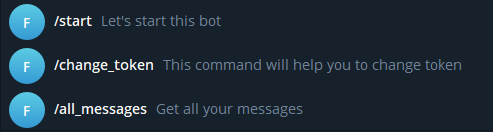

# Дублирование сообщений в телеграм боте

## Как развернуть проект
- скачать репозиторий, перейти в директорию с ```docker-compose.yml```

- создаем телеграм бота через https://t.me/BotFather и сохраняем токен

- заполнить переменные среды заполнив файл ```.env```

- собрать и запустить докер-сборку

```docker-compose up -d --build```

```docker-compose up```

- post запрос через postman, x-www-form-urlencoded способом, отправлять — username, password, name:

- http://localhost:8000/factory_bot/registration

- http://localhost:8000/factory_bot/login


- токен который получили после запроса login

- команды бота: 

- тестируем